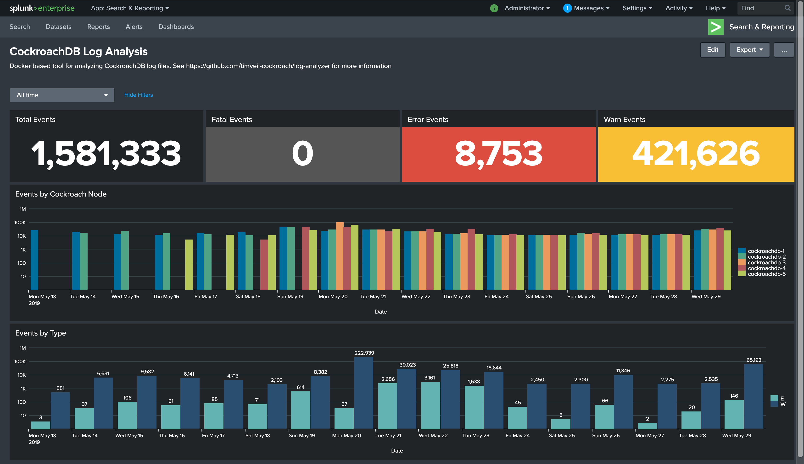

# CockroachDB Log File Analyzer with Splunk

> Due a possible issue with log files generated by the `cockroach debug zip` command, all files will have a `date created` as `11/30/1979` causing a variety of unfortunate issues in Splunk.  Fixes and workarounds are in progress.  See https://github.com/cockroachdb/cockroach/issues/33680

## Overview

This simple project spins up and properly configures a single node Splunk Docker image and parses a provided `debug.zip` file containing CockroachDB log files.  The intent of this project is to simplify troubleshooting of log files across a multi-node CockroachDB cluster. Since the timestamps included in the current version of CockroachDB log files are not parsed correctly by Splunk out of the box, a number of configurations have been modified to support the CockroachDB format.  Those configurations can be found in the `splunk > conf` directory.

For example, a typical line in a CockroachDB log file looks like this...
```
I181220 15:30:03.971234 1 util/log/clog.go:1176  [config] running on machine: us-central1-node-0003
```

Where the first character is either `I`, `W`, `E` or `F`, signifying an `INFO`, `WARN`, `ERROR` or `FATAL` statement.  Immediately following the log level is the custom timestamp, which is equivalent to `%y:%m:%d %H:%M:%S.%6N` in standard Unix `strptime()` parlance.  The rest of the log statement is application specific.



## Prerequisites
* Latest Docker edition that supports `docker-compose`.  I use the latest "Docker Desktop" for Mac for my testing.
* A `debug.zip` file generated by CockroachDB.  See https://www.cockroachlabs.com/docs/stable/debug-zip.html

## Getting Started
1) Place a CockroachDB generated `debug.zip` file in the root this projects `splunk` directory.

2) Run `./run-start.sh` to bring up the Splunk instance and begin indexing your CockroachDB `debug.zip` file.

3) To access the Splunk UI go to `http://localhost:8000`.  The username is `admin` and the password is `roach1234` as specified by the `SPLUNK_PASSWORD` environment variable in the `docker-compose.yml` file.

4) To stop and cleanup, run `./run-clean.sh`.  This will stop Splunk and execute `docker system prune -a -f ...`.

## Thoughts and Considerations
* This is useful for analyzing a relatively small amount of data given this single node, Docker based approach.  Adjustments could be made to scale this but are beyond the scope of my initial effort.
* The configurations used here, specifically those found in `inputs.conf` and `props.conf` could be easily ported to a proper Splunk environment to enable real-time CockroachDB log parsing, etc.

## Helpful Commands
Open interactive shell with `splunk` container
```
docker-compose exec splunk /bin/bash
```

Search for all `E` or error log messages sorted by `_time` (log entry timestamp) descending
```
sourcetype=cockroach_log cockroach_log_level=E | sort _time
```

Search all log messages sorted by `_time` (log entry timestamp) descending 
```
sourcetype=cockroach_log | sort _time
```